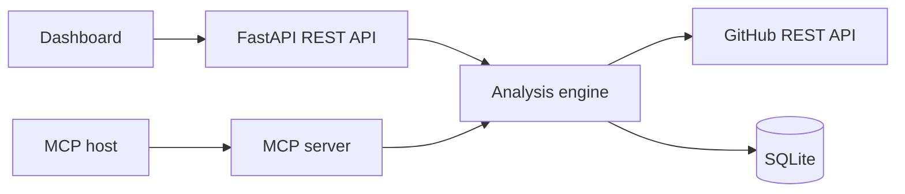

# Quorum Git Agent

Repository intelligence for engineering teams, available through a visual
dashboard, REST API and Model Context Protocol tools.

Quorum inspects a public GitHub repository, calculates a transparent health
score, triages open issues, highlights delivery risks and stores every report
in SQLite. It works without an LLM key; an MCP-compatible host can use the
tools immediately.

## What it demonstrates

- Python 3.11 and FastAPI service design
- GitHub REST API integration with rate-limit handling
- SQL persistence with migrations created on startup
- MCP tools built with the official Python SDK
- deterministic repository scoring and issue triage
- responsive dashboard with no frontend build step
- pytest, Ruff, Docker and GitHub Actions

## Architecture



## Quick start

```powershell
git clone https://github.com/rom4ik1346/quorum-git-agent.git
cd quorum-git-agent
python -m venv .venv
.\.venv\Scripts\python.exe -m pip install -e ".[dev]"
.\start.ps1
```

Open:

- dashboard: `http://127.0.0.1:8010`
- Swagger UI: `http://127.0.0.1:8010/docs`
- health check: `http://127.0.0.1:8010/api/health`

The dashboard starts with a seeded fictional repository report, so the
interface is useful before the first external API request.

## GitHub token

Public repositories can be analyzed without a token. To increase the API rate
limit, copy `.env.example` to `.env` and add a fine-grained token:

```dotenv
GITHUB_TOKEN=github_pat_your_token
```

The token is read only on the server and is never returned to the browser.

## MCP server

Run the stdio server:

```powershell
.\.venv\Scripts\python.exe -m app.mcp_server
```

Example client configuration:

```json
{
  "mcpServers": {
    "quorum": {
      "command": "C:\\path\\to\\quorum-git-agent\\.venv\\Scripts\\python.exe",
      "args": ["-m", "app.mcp_server"],
      "cwd": "C:\\path\\to\\quorum-git-agent"
    }
  }
}
```

Available tools:

- `analyze_repository`
- `list_recent_analyses`
- `get_repository_brief`
- `create_action_item`

## REST examples

```powershell
Invoke-RestMethod `
  -Method Post `
  -Uri http://127.0.0.1:8010/api/analyses `
  -ContentType "application/json" `
  -Body '{"repository":"fastapi/fastapi"}'
```

```powershell
Invoke-RestMethod http://127.0.0.1:8010/api/analyses
```

## Tests

```powershell
.\.venv\Scripts\python.exe -m ruff check .
.\.venv\Scripts\python.exe -m pytest --cov=app
```

## Docker

```powershell
docker compose up --build
```

The SQLite database is stored in the `quorum-data` volume.

## Project structure

```text
app/
  analyzer.py       transparent scoring and issue triage
  database.py       SQLite repository
  github_client.py  async GitHub REST client
  main.py           FastAPI application
  mcp_server.py     MCP tool surface
  static/           dashboard
tests/              unit and API tests
```

## License

MIT

